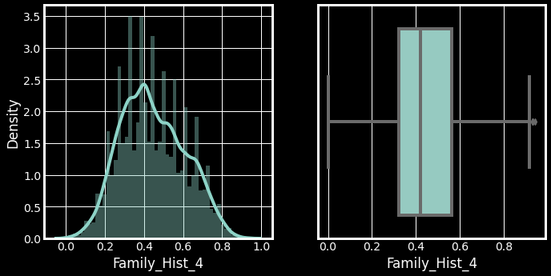

# Risk-Prediction-in-Life-Insurance

<br/>
<p align="center">
  <h3 align="center">Risk level prediction in life insurance.</h3>

  <p align="center">
    Extensive EDA and feature engineering along with Machine Learning modelling using XGBoost, Stacked and Max Voting Model for risk level prediction.
    <br/>
    <br/>
    <a href="https://github.com/yashcoder007/Risk-Prediction-in-Life-Insurance"><strong>Explore the docs »</strong></a>
    <br/>
    <br/>
    <a href="https://github.com/yashcoder007/Risk-Prediction-in-Life-Insurance">View Demo</a>
    .
    <a href="https://github.com/yashcoder007/Risk-Prediction-in-Life-Insurance/issues">Report Bug</a>
    .
  </p>
</p>

      

## Table Of Contents

* [About the Project](#about-the-project)
* [Built With](#built-with)
* [Getting Started](#getting-started)
  * [Prerequisites](#prerequisites)
  * [Installation](#installation)
* [Usage](#usage)
* [Contributing](#contributing)
* [License](#license)
* [Authors](#authors)
* [Acknowledgements](#acknowledgements)

## About The Project



The project's motivation was to detect financial credit card transaction fraud on a dataset with around 1 million transactions listed. I designed an end-to-end data pipeline for this project. 

Firstly, I did extensive data analytics using libraries like Pandas, Matplotlib, Seaborn and NumPy. I created a lot of count plots, point plots, and other graphs.

Secondly, I did some Feature Engineering using a Dimensionality Reduction technique called PCA. Cleaning and imputing missing values was also a part of this stage.

Thirdly, I did hyperparameter tuning to find the best parameters for my model. The best parameters were then selected for modelling XGBoost. 

Lastly, I could identify the most important features involved in fraudulent transactions.


## Built With

Python

* [jupyter ](https://jupyter.org/)
* [scikit-learn](https://scikit-learn.org/stable/)
* [Numpy](https://numpy.org/)
* [pandas](https://pandas.pydata.org/)
* [SciPy](https://scipy.org/)
* [Matplotlib](https://matplotlib.org/)
* [XGBoost](https://xgboost.readthedocs.io/en/stable/parameter.html)


## Getting Started

Create a new virtual environment and install all the required packages.

### Prerequisites

The python libraries mentioned in Built With

### Installation

1. Download the dataset
```sh
https://www.kaggle.com/competitions/ieee-fraud-detection/data
```
2. Clone the repo

```sh
https://github.com/yashcoder007/Fraud-Transaction_Detection-using-machine-learning.git
```

3. Google Collab version.

```sh
https://colab.research.google.com/drive/1NHOtVjPaRVGKwQPgBzHhF8bTJKKPSlHO
```

4. Install packages using  conda or pip.
For example:  "pip install -U scikit-learn" or "conda install -c conda-forge scikit-learn"

            jupyter
            scikit-learn
            Numpy
            pandas
            SciPy
            Matplotlib
            XGBoost

## Usage

1. Download the dataset from the link given.
2. Clone the repo
3. Download and use the .ipynb with jupyter notebooks.
4. Download and use the .py with PyCharm.


## Contributing

Contributions are what make the open source community such an amazing place to be learn, inspire, and create. Any contributions you make are **greatly appreciated**.
* If you have suggestions for adding or removing projects, feel free to [open an issue](https://github.com/yashcoder007/Fraud-Transaction_Detection-using-machine-learning/issues/new) to discuss it, or directly create a pull request after you edit the *README.md* file with necessary changes.
* Please make sure you check your spelling and grammar.
* Create individual PR for each suggestion.
* Please also read through the [Code Of Conduct](https://github.com/yashcoder007/Fraud-Transaction_Detection-using-machine-learning/blob/main/CODE_OF_CONDUCT.md) before posting your first idea as well.

### Creating A Pull Request

1. Fork the Project
2. Create your Feature Branch (`git checkout -b feature/AmazingFeature`)
3. Commit your Changes (`git commit -m 'Add some AmazingFeature'`)
4. Push to the Branch (`git push origin feature/AmazingFeature`)
5. Open a Pull Request

## License

Distributed under the MIT License. See [LICENSE](https://github.com/yashcoder007/Fraud-Transaction_Detection-using-machine-learning/blob/main/LICENSE.md) for more information.

## Authors

* **Yash Trivedi** - *Data Scientist/ Machine Learning Researcher* - [Yash Trivedi](https://github.com/yashcoder007)

